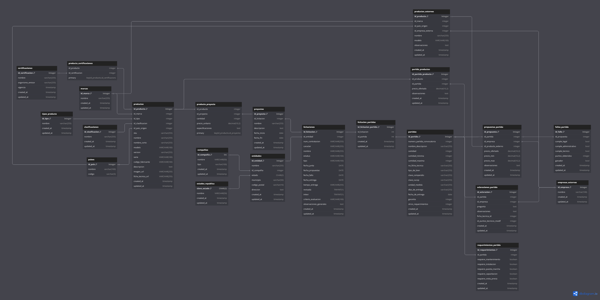

# 🏗️ Sistema de Gestión de Licitaciones - INTEVI

Este proyecto es un sistema integral para administrar **licitaciones públicas**, con un enfoque especial en la organización de productos médicos, proyectos asociados y procesos licitatorios complejos.

---

## 📌 ¿Qué es una licitación?

Una **licitación** es un proceso mediante el cual una entidad pública o privada solicita formalmente la adquisición de bienes o servicios, seleccionando al proveedor mediante una convocatoria competitiva. Este sistema permite a **INTEVI** controlar y documentar cada etapa del proceso en México.

---

## 🧩 Módulos del sistema 

### 🗂️ Inventario Extendido (Core)
El CRUD de productos ahora incluye una arquitectura de tablas relacionadas 1:1 para datos especializados:
- **Información Básica:** SKU, modelo, serie y especificaciones técnicas.
- **Logística e Inventario:** Gestión de unidades de medida, pesos, volúmenes, métodos de costeo y control de lotes/caducidades.
- **Contabilidad e Impuestos:** Configuración de IEPS, claves de producto, empaques y presentaciones.
- **Comercio Exterior:** Modelado de fracciones arancelarias y factores de conversión para equipos importados.

### 📂 Gestión Documental (Catálogos y Versiones)
Módulo optimizado para el control de archivos técnicos:
- **Catálogos Generales:** Documentos de uso global para el equipo de ventas.
- **Catálogos por Licitación:** Vinculación quirúrgica de documentos a una **Partida** específica de una licitación.
- **CRUD Documental:** Interfaz para subir, editar, visualizar (PDF) y eliminar versiones con trazabilidad por `updated_at`.

### 🏗️ Proyectos y Licitaciones
- **Proyectos:** Vinculación de productos ganados con cantidades y precios unitarios.
- **Licitaciones:** Gestión de fechas clave (junta, propuestas, fallo) integradas al calendario.
- **Archivos de Licitación:** Repositorio centralizado para Bases, Anexos y Juntas de Aclaraciones mediante links externos.

### 🔐 Autenticación
Permite la creación y gestión de usuarios con nombre, correo y contraseña. Las contraseñas se encriptan utilizando bcrypt. El acceso al sistema requiere una cuenta. Se contempla la implementación de niveles de usuario con restricciones futuras.

### 🗓 Calendario
Integrado con FullCalendar JS, este módulo muestra las fechas clave de las licitaciones. Ofrece vistas anual, mensual y semanal, alertando sobre la proximidad de eventos y el tiempo transcurrido desde ellos, con la posibiliad de editar las licitaciones y acceder a las mismas, tiene la intención de ser la vista principal de administración.

### 📦 Catálogo de Productos
Un módulo dedicado a la visualización de los productos de INTEVI, permitiendo un acceso rápido a sus datos, incluyendo fichas técnicas y otra documentación relevante. Cuenta con filtros para una búsqueda eficiente de productos.

### ⚙️ Menu de Opciones
Este es el centro de administración de catálogos y entidades del sistema. Desde aquí se gestionan todos los datos maestros necesarios para el funcionamiento de la aplicación:
- Datos de Referencia: Permite la gestión de catálogos auxiliares como:
  - Marcas
  - Tipos de producto
  - Clasificaciones
  - Países
  - Certificaciones
  - Compañías
- Empresas y Productos Externos: Administración de las empresas de la competencia y el catálogo de productos que estas ofertan.
- Entidades: Administración de las instituciones (hospitales, clínicas, etc.) a las que se les da servicio.
- Usuarios: Gestión de los perfiles y credenciales de los usuarios que pueden acceder al sistema.

---

## 🛠️ Tecnologías utilizadas

### Backend
- **Lenguaje:** Go 1.24.2
- **Frameworks:** `chi/v5` (Router), `scs/v2` (Sesiones), `nosurf` (CSRF), `bcrypt` (Seguridad).

### Base de Datos
- **Motor:** MySQL 8.0.41
- **Diseño:** Relacional normalizado con soporte para nulos en relaciones opcionales.

### Frontend
- **Bootstrap 5.1.3** – Framework CSS
- **FontAwesome 6** – Íconos
- **FullCalendar@6.1.7** – Librería JavaScript para calendario
- HTML renderizado mediante plantillas Go (`html/template`)
  
---

## 🧱 Modelo de datos (estructura general)

El sistema se basa en un modelo relacional robusto, diseñado para gestionar el ciclo completo de licitaciones públicas, desde la administración de productos hasta la evaluación de propuestas y adjudicación de partidas. La base de datos está normalizada y estructurada en las siguientes categorías principales:

### 🏷️ Datos base y de referencia
Estas tablas permiten gestionar información esencial para el control de productos y entidades involucradas:

- `marcas`, `tipos_producto`, `clasificaciones`, `paises`, `certificaciones`: características y clasificación de productos.
- `entidades`, `compañias`, `estados_republica`: representan a las instituciones que emiten las licitaciones.
- `empresas_externas`: empresas que participan como proveedores.

### 📦 Inventario de productos
- `productos`: contiene información detallada de cada producto como nombre, modelo, serie, ficha técnica, país de origen, etc.
- `producto_certificaciones`: relación N:M entre productos y certificaciones.

### 📁 Gestión de proyectos
- `proyectos`: representan la agrupación lógica de productos seleccionados para participar en una licitación específica.
- `producto_proyecto`: define qué productos y en qué cantidades están incluidos en un proyecto.

### 📜 Licitaciones y estructura de partidas
- `licitaciones`: entidad principal del sistema. Contiene metadatos como fechas clave, tipo de licitación, entidad emisora, etc.
- `partidas`: componentes individuales de una licitación, cada una con requerimientos específicos de productos.
- `licitacion_partidas`: relación entre una licitación y sus partidas.

### 🔗 Relaciones dinámicas
Estas tablas documentan la interacción de las empresas con cada partida:

- `partida_productos`: productos ofertados por partida con precio y observaciones.
- `requerimientos_partida`: requisitos técnicos o de servicio por partida (mantenimiento, capacitación, instalación, etc.).
- `aclaraciones_partida`: preguntas o solicitudes de aclaración hechas por empresas durante la etapa de junta de aclaraciones.
- `propuestas_partida`: productos propuestos por cada empresa para una partida.
- `fallos_partida`: resultado de evaluación de propuestas, incluye cumplimiento de criterios técnicos, administrativos y legales, así como puntos obtenidos y si resultó ganador.

---

## 🧱 Modelo de datos extendido

La base de datos se ha estructurado para soportar el crecimiento administrativo de **INTEVI**:

- **`producto_catalogos`**: Almacena versiones de folletos técnicos vinculados opcionalmente a `licitaciones` y `partida_productos`.
- **`producto_inventario`**: Atributos logísticos detallados (largo, ancho, peso, manejo de serie/lote).
- **`producto_IEPS`**: Datos fiscales para facturación y costos.
- **`producto_comercio_exterior`**: Información para procesos de aduana e importación.
- **`archivos_licitacion`**: Repositorio de links para la documentación oficial de cada convocatoria.

---

## 📷 Documentación y Vídeos

- **Video explicativo (20 mayo 2025):** [Ver en YouTube](https://www.youtube.com/watch?v=8oavojJYFSY&t=1s)
- **Video Teaser App (4 de Octubre de 2025):** [Ver en YouTube](https://youtu.be/PfJXXYc0cos)

Estructura base de datos:

---

## 📄 Licencia

**PROYECTO PRIVADO - USO INTERNO ADMINISTRATIVO.**
Este software es propiedad exclusiva de **INTEVI / Mednodes**. Queda estrictamente prohibida su reproducción, distribución o modificación sin autorización expresa.

---

## ✍️ Autor
| [ **Jose Luis Valencia** Ingeniero Biomedico](https://github.com/Cogito-ergo-sum25) |
| :---: |

Contacto: valencia.rivera.jose.luis@gmail.com